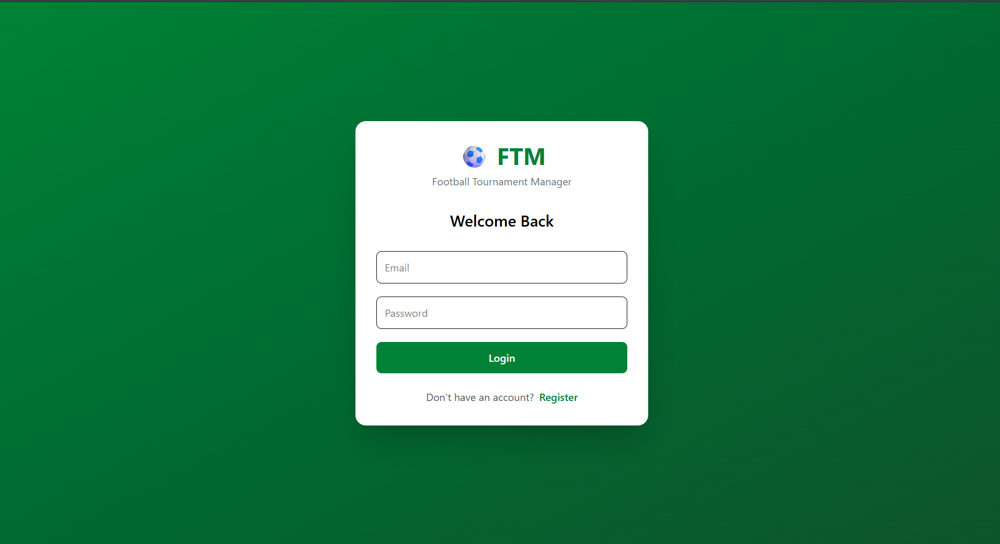
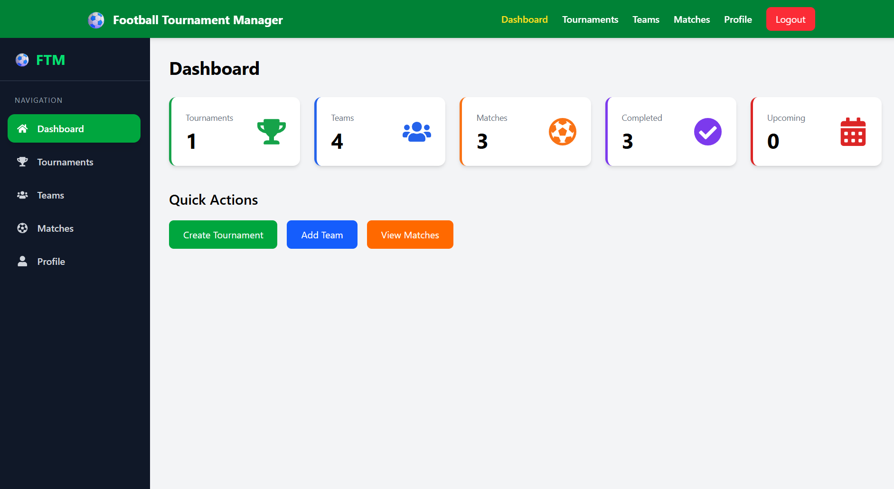
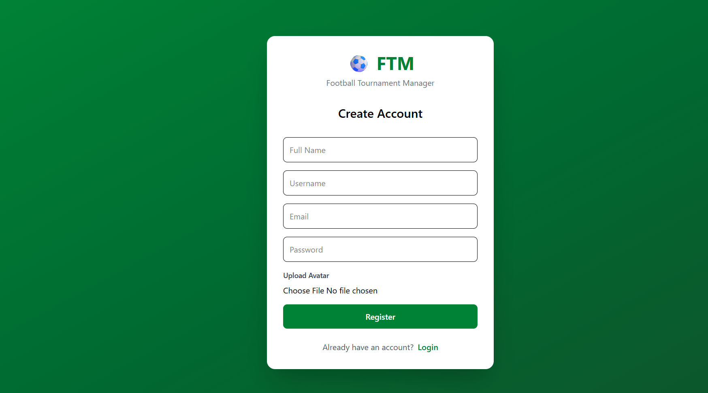
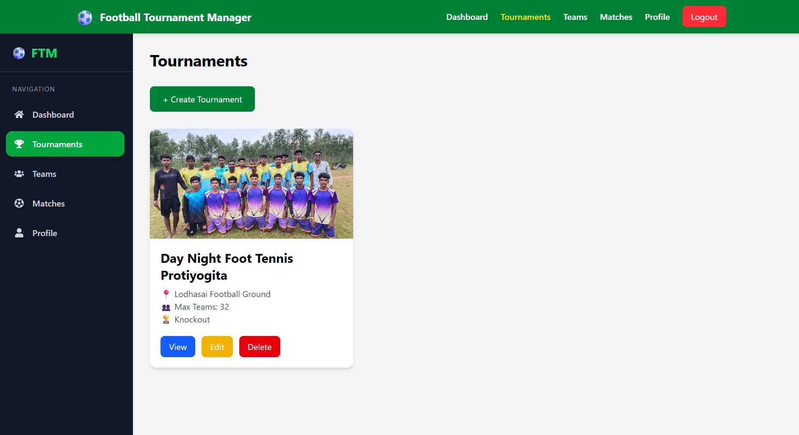
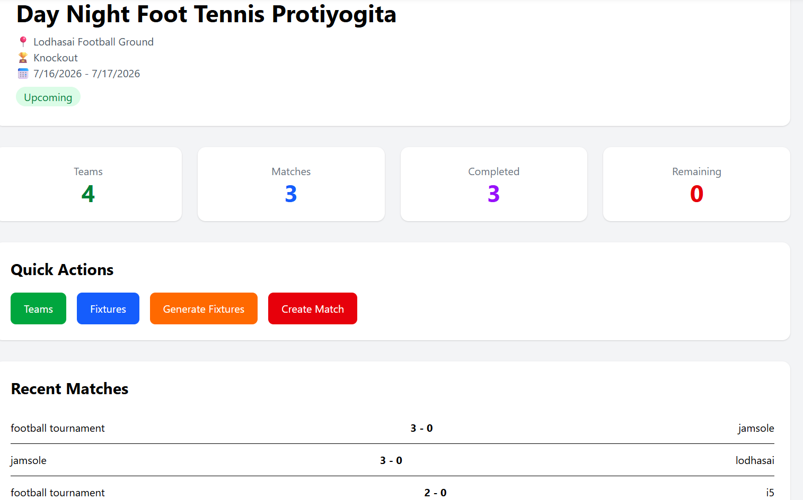
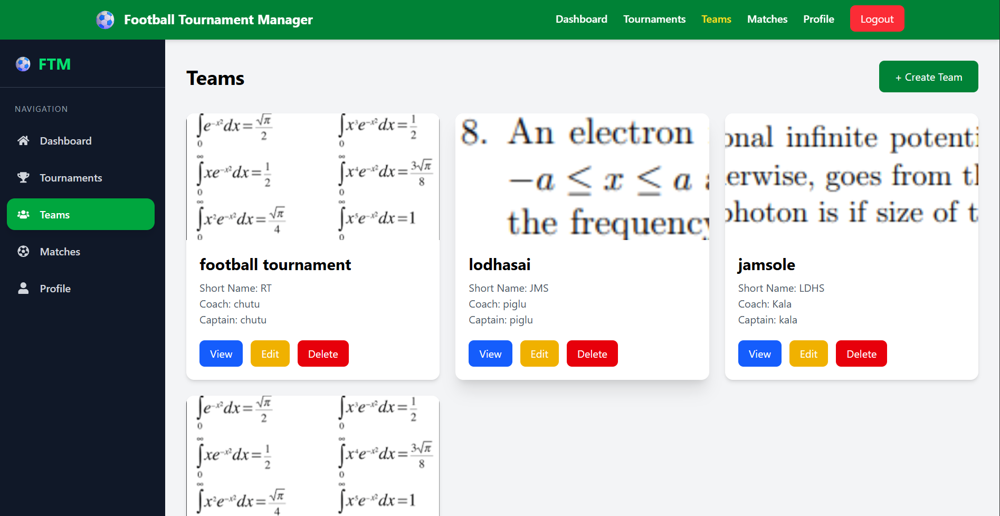
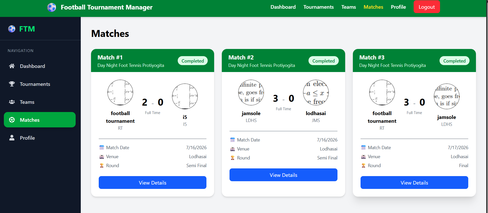
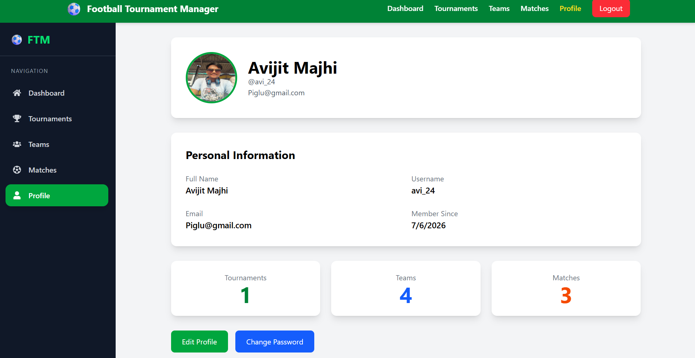

# ⚽ Football Tournament Management System

A full-stack MERN application for organizing and managing football tournaments. The platform allows organizers to create tournaments, register teams, generate fixtures, manage matches, and track standings through an intuitive dashboard.

---

## 🚀 Features

### 🔐 Authentication
- User Registration & Login
- JWT Authentication
- Protected Routes
- User Profile Management

### 🏆 Tournament Management
- Create, Update & Delete Tournaments
- Tournament Dashboard
- Tournament Details

### 👥 Team Management
- Add Teams
- Edit Team Information
- Delete Teams
- Team Listing

### 📅 Fixture Generation
- Automatic League Fixture Generation
- Knockout Tournament Support
- League + Knockout Hybrid Format

### ⚽ Match Management
- Schedule Matches
- Update Match Results
- Automatic Standings Update

### 📊 Dashboard
- Tournament Statistics
- Team Statistics
- Match Overview

### ☁️ Media Upload
- Cloudinary Image Upload

---

# 🛠 Tech Stack

## Frontend

- React.js
- React Router DOM
- Tailwind CSS
- Axios
- React Icons

## Backend

- Node.js
- Express.js
- MongoDB
- Mongoose
- JWT Authentication
- Cloudinary
- Multer

---

# 📂 Project Structure

```
Football-Tournament-Management-System
│
├── frontend
│   ├── src
│   ├── public
│   ├── package.json
│   └── ...
│
├── backend
│   ├── src
│   │   ├── controllers
│   │   ├── routes
│   │   ├── models
│   │   ├── middlewares
│   │   ├── services
│   │   └── utils
│   ├── package.json
│   └── ...
│
└── README.md
```

---

# ✨ Key Features

- ✅ JWT Authentication
- ✅ Role-Based Authorization
- ✅ CRUD Operations
- ✅ Automatic Fixture Generation
- ✅ League & Knockout Tournament Support
- ✅ Tournament Dashboard
- ✅ Team Management
- ✅ Match Scheduling
- ✅ Standings Calculation
- ✅ Cloudinary Image Upload
- ✅ Responsive User Interface

---

# 📸 Screenshots

> Add your screenshots inside a folder named **screenshots**.

```
screenshots/
├── login.png
├── dashboard.png
├── tournaments.png
├── teams.png
├── fixtures.png
├── standings.png
```

Example:

# 📸 Screenshots

## 🔐 Login



---

## 📊 Dashboard



---

## 👤 Register



---

## 🏆 Tournaments



---

## 🏟 Tournament Details



---

## 👥 Teams



---

## ⚽ Matches



---

## 👤 Profile



---

# ⚙️ Installation

## Clone Repository

```bash
git clone https://github.com/AvijitMajhi/Football-Tournament-Management-System.git
```

## Frontend

```bash
cd frontend
npm install
npm run dev
```

Runs on:

```
http://localhost:5173
```

---

## Backend

```bash
cd backend
npm install
npm run dev
```

Runs on:

```
http://localhost:8000
```

---

# 🔑 Environment Variables

Create a `.env` file inside the **backend** folder.

```env
PORT=8000

MONGODB_URI=your_mongodb_connection_string

ACCESS_TOKEN_SECRET=your_access_token_secret

ACCESS_TOKEN_EXPIRY=1d

REFRESH_TOKEN_SECRET=your_refresh_token_secret

REFRESH_TOKEN_EXPIRY=10d

CLOUDINARY_CLOUD_NAME=your_cloud_name

CLOUDINARY_API_KEY=your_api_key

CLOUDINARY_API_SECRET=your_api_secret
```

---

# 🔮 Future Improvements

- Player Management
- Live Score Tracking
- Match Analytics
- Tournament Invitations
- Email Notifications
- Referee Management

---

# 👨‍💻 Author

**Avijit Majhi**

- GitHub: https://github.com/AvijitMajhi
- LinkedIn: https://www.linkedin.com/in/avijit-majhi-ab8103326/

---

⭐ If you found this project useful, consider giving it a **Star**.